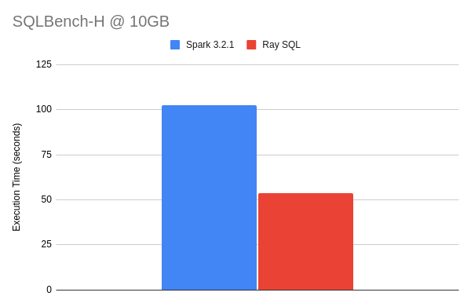
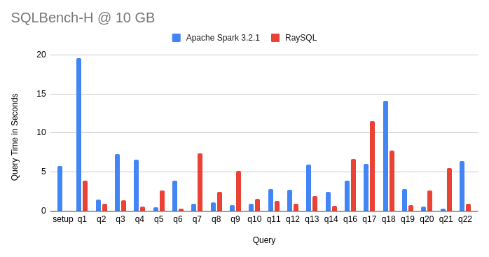

<!---
  Licensed to the Apache Software Foundation (ASF) under one
  or more contributor license agreements.  See the NOTICE file
  distributed with this work for additional information
  regarding copyright ownership.  The ASF licenses this file
  to you under the Apache License, Version 2.0 (the
  "License"); you may not use this file except in compliance
  with the License.  You may obtain a copy of the License at

    http://www.apache.org/licenses/LICENSE-2.0

  Unless required by applicable law or agreed to in writing,
  software distributed under the License is distributed on an
  "AS IS" BASIS, WITHOUT WARRANTIES OR CONDITIONS OF ANY
  KIND, either express or implied.  See the License for the
  specific language governing permissions and limitations
  under the License.
-->

# DataFusion on Ray

> This was originally a research project donated from [ray-sql] to evaluate performing distributed SQL queries from 
> Python, using [Ray] and [Apache DataFusion]

[ray-sql]: https://github.com/datafusion-contrib/ray-sql

DataFusion Ray is a distributed Python DataFrame and SQL query engine powered by the Rust implementation 
of [Apache Arrow], [Apache DataFusion], and [Ray].

[Ray]: https://www.ray.io/
[Apache Arrow]: https://arrow.apache.org/
[Apache DataFusion]: https://datafusion.apache.org/

## Comparison to other DataFusion projects

### Comparison to DataFusion Ballista

- Unlike [DataFusion Ballista], DataFusion Ray does not provide its own distributed scheduler and instead relies on 
  Ray for this functionality. As a result of this design choice, DataFusion Ray is a much smaller and simpler project.
- DataFusion Ray is Python-first, and DataFusion Ballista is Rust-first

[DataFusion Ballista]: https://github.com/apache/datafusion-ballista

### Comparison to DataFusion Python

- [DataFusion Python] provides 

[DataFusion Python]: https://github.com/apache/datafusion-python

## Example

Run the following example live in your browser using a Google Colab [notebook](https://colab.research.google.com/drive/1tmSX0Lu6UFh58_-DBUVoyYx6BoXHOszP?usp=sharing).

```python
import os
import ray

from datafusion_ray import DatafusionRayContext

SCRIPT_DIR = os.path.dirname(os.path.realpath(__file__))

# Start a local cluster
ray.init(resources={"worker": 1})

# Create a context and register a table
ctx = DatafusionRayContext(2)
# Register either a CSV or Parquet file
# ctx.register_csv("tips", f"{SCRIPT_DIR}/tips.csv", True)
ctx.register_parquet("tips", f"{SCRIPT_DIR}/tips.parquet")

result_set = ctx.sql(
  "select sex, smoker, avg(tip/total_bill) as tip_pct from tips group by sex, smoker"
)
for record_batch in result_set:
  print(record_batch.to_pandas())
```

## Status

- DataFusion Ray can run all queries in the TPC-H benchmark

## Features

- Mature SQL support (CTEs, joins, subqueries, etc) thanks to DataFusion
- Support for CSV and Parquet files

## Performance

This chart shows the performance of DataFusion Ray compared to Apache Spark for
[SQLBench-H](https://sqlbenchmarks.io/sqlbench-h/) at a very small data set (10GB), running on a desktop (Threadripper
with 24 physical cores). Both DataFusion Ray and Spark are configured with 24 executors.

### Overall Time

DataFusion Ray is ~1.9x faster overall for this scale factor and environment with disk-based shuffle.



### Per Query Time

Spark is much faster on some queries, likely due to broadcast exchanges, which DataFusion Ray hasn't implemented yet.



## Building

```bash
# prepare development environment (used to build wheel / install in development)
python3 -m venv venv
# activate the venv
source venv/bin/activate
# update pip itself if necessary
python -m pip install -U pip
# install dependencies (for Python 3.8+)
python -m pip install -r requirements-in.txt
```

Whenever rust code changes (your changes or via `git pull`):

```bash
# make sure you activate the venv using "source venv/bin/activate" first
maturin develop python -m pytest 
```

## Testing

Running local Rust tests require generating the tpch-data. This can be done
by running the following commands:

```bash
export TPCH_TEST_PARTITIONS=1
export TPCH_SCALING_FACTOR=1
./scripts/gen-test-data.sh
```

This will generate data into a top-level `data` directory.

Tests can be run with:

```shell
export TPCH_DATA_PATH=`pwd`/data
cargo test
```

## Benchmarking

Create a release build when running benchmarks, then use pip to install the wheel.

```bash
maturin develop --release
```

## How to update dependencies

To change test dependencies, change the `requirements.in` and run

```bash
# install pip-tools (this can be done only once), also consider running in venv
python -m pip install pip-tools
python -m piptools compile --generate-hashes -o requirements-310.txt
```

To update dependencies, run with `-U`

```bash
python -m piptools compile -U --generate-hashes -o requirements-310.txt
```

More details [here](https://github.com/jazzband/pip-tools)
